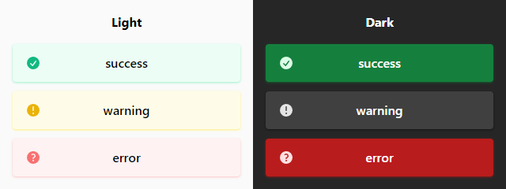

# EPFN Components for SvelteKit

Opinionated SvelteKit components for my personal purposes.

## Installation

```
npm i epfn-sveltekit-components
```

## Import component

```svelte
<script>
	import { Drawer } from 'epfn-sveltekit-components';
</script>
```

## Drawer

Headless-like side appearing drawer with backdrop. You must provide content (with styles) via default slot.

Button position is controlled by putting **Drawer Component** anywhere you like. Drawer position is controlled via **placement** prop.

### Props

| prop      | description                        | type              | default value |
| --------- | ---------------------------------- | ----------------- | ------------- |
| isOpen    | state of Drawer                    | boolean           | false         |
| width     | width of Drawer in px              | number            | 260           |
| placement | position of Drawer                 | "left" \| "right" | "left"        |
| duration  | duration of Drawer animation in ms | number            | 150           |

### Slots

| slot    | description           |
| ------- | --------------------- |
| default | content inside drawer |

### Styling

| CSS variable                | description                   | fallback value      |
| --------------------------- | ----------------------------- | ------------------- |
| --drawer-backdrop-color     | color of backdrop             | rgba(0, 0, 0, 0.75) |
| --drawer-close-button-color | color of SVG icon (X)         | black               |
| --drawer-open-button-color  | color of SVG icon (Hamburger) | black               |

## Menu

List of links.

### Props

| prop     | description                      | type                                                | default value |
| -------- | -------------------------------- | --------------------------------------------------- | ------------- |
| links    | array of links                   | { href: string; label: string; active?: boolean }[] |               |
| type     | style of menu                    | "header" \| "drawer"                                |               |
| on:click | on:click event forwarded to link |                                                     |               |

### Styling

| CSS variable        | description                        | fallback value |
| ------------------- | ---------------------------------- | -------------- |
| --menu-border-color | color of border between list items | gray           |
| --menu-border-width | thickness of underline             | 2px            |

## Spinner

Usual animated spinner

### Styling

| CSS variable    | description      | fallback value |
| --------------- | ---------------- | -------------- |
| --spinner-color | color of spinner | white          |

## Alerts

Vertical list of animated alerts

<!--  -->

### Props

| prop     | description                                             | type                                                        | default value |
| -------- | ------------------------------------------------------- | ----------------------------------------------------------- | ------------- |
| items    | array of alerts                                         | { text: string; type: 'success' \| 'error' \| 'warning' }[] |               |
| duration | duration of alert animation in ms                       | number                                                      | 200           |
| theme    | color theme, 'both' includes both light and dark themes | 'both' \| 'light' \| 'dark'                                 | 'both'        |

## FieldText, FieldEmail, FieldPassword, FieldTextarea, FieldCheckbox

Inputs with label

| prop     | description                                             | type                               | default value |
| -------- | ------------------------------------------------------- | ---------------------------------- | ------------- |
| value    | value for input binding                                 | string                             | ""            |
| label    | text for label                                          | string                             |               |
| name     | text for input name attribute                           | string                             |               |
| required | value for input required attribute                      | boolean                            | false         |
| readonly | value for input readonly attribute                      | boolean                            | false         |
| error    | value for input aria-invalid attribute                  | boolean                            | false         |
| hidden   | if true checkbox is hidden                              | boolean                            | false         |
| rows     | value for textarea rows attribute                       | number                             | 8             |
| theme    | color theme, 'both' includes both light and dark themes | 'both' \| 'light' \| 'dark'        | 'both'        |
| accent   | color for border and outline on hover or focus          | 'bw' \| 'gray' \| 'blue' \| 'pink' | 'bw'          |
